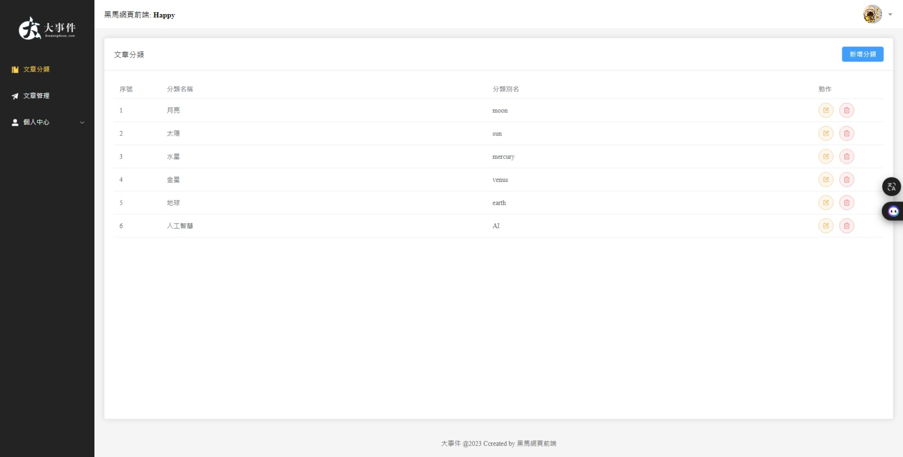
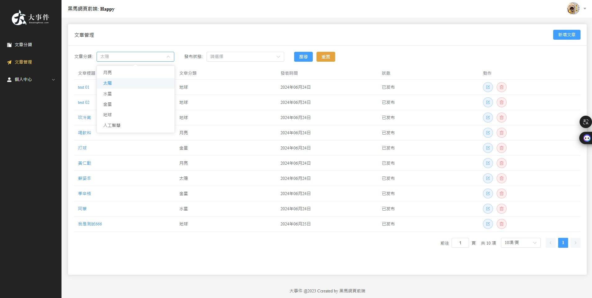
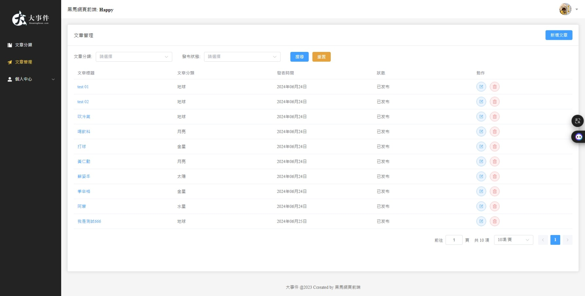
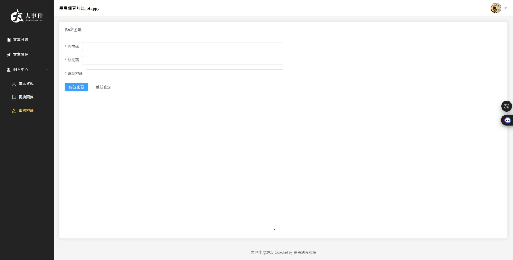
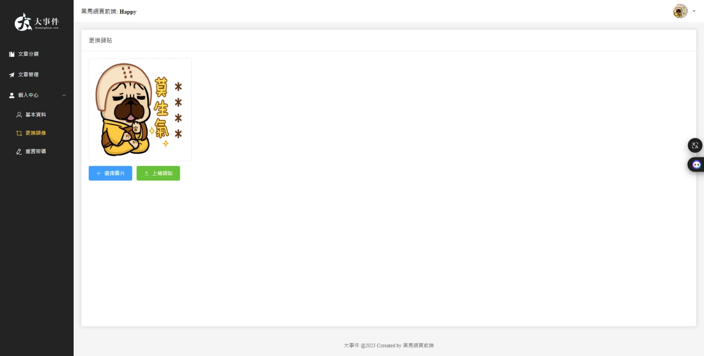
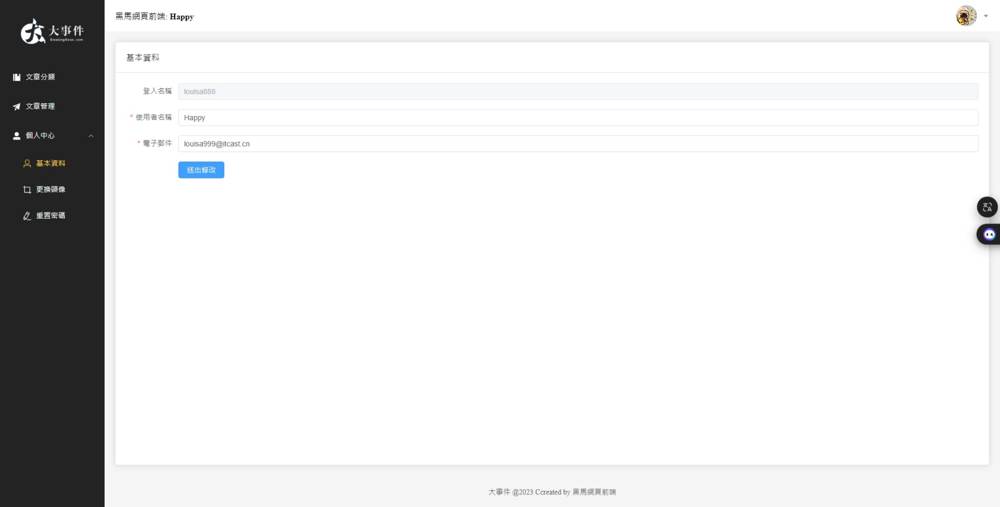
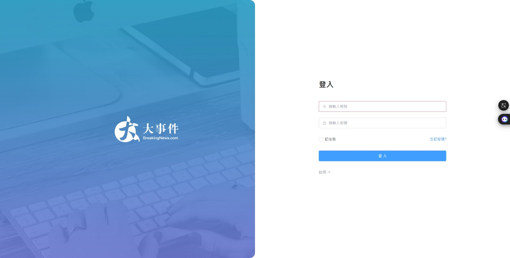
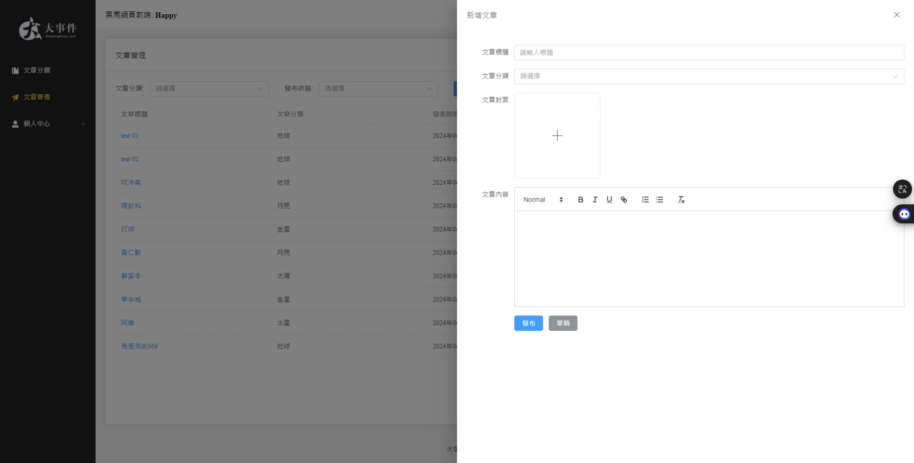
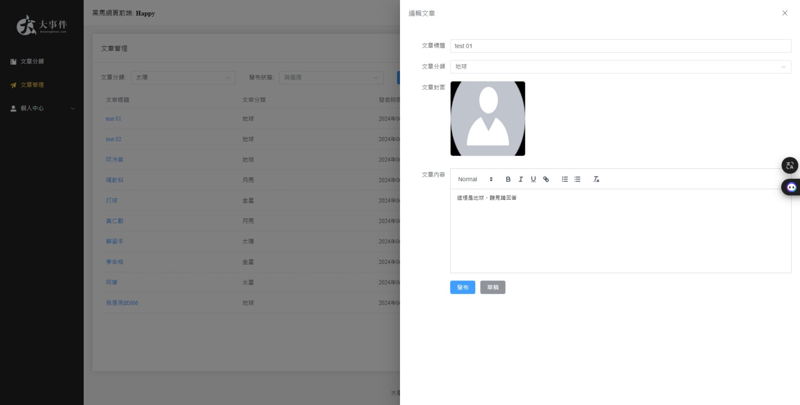

# 專案原作者、影片來源
[點我看原作者YouTube頻道](https://www.youtube.com/watch?v=7YDDbKH09uA&list=PLFbd8KZNbe-9ORQoy5UG9bczPvbHTebnS)

# 本專案發想與用意
- 第二個練習專案，做一個內容管理的系統後台，主要用來熟悉Vue2, 3和Element-Plus的語法和使用場景，以及了解專案的大致開發階段與流程

# 開發時程
- 原影片總時長約**10小時**
- 實際開發時長約**2週**

# 事件管理系統
1. Vue3 composition API
2. Vue Router 路由規劃
3. Pinia / Pinia 資料持久化處理
4. Element Plus (表單校驗、表格處理、元件封裝)
5. pnpm 工具箱管理
6. ESlint + Prettier 規範設置

# 專案經開啟 Live Server 後瀏覽器畫面與對應檔案名稱如下
1. 文章分類_ArticleChannel.jpeg
    - 

2. 文章單選下拉框_ChannelSelect.jpeg
    - 

3. 文章管理_ArticleManage.jpeg
    - 

4. 修改密碼_UserPassword.jpeg
    - 

5. 個人中心_更換大頭貼_UserAvatar.jpeg
    - 

6. 個人中心_基本資料_UserProfile.jpeg
    - 

7. 登入頁_LoginPage.jpeg
    - 

8. 新增文章_ArticleEdit.jpeg
    - 

9.  編輯文章_ArticleEdit.jpeg
    - 
